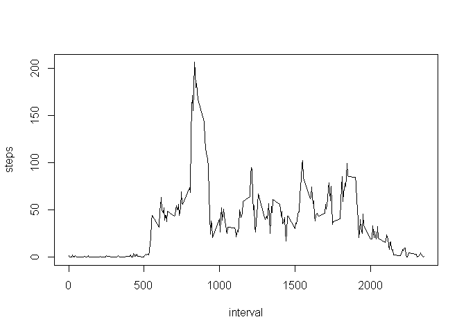

Knitr Assignment (Peer Assignment \#1 - Nov 2017)
=================================================

Loading and preprocessing the data
----------------------------------

    library(knitr)
    data <- read.csv("activity.csv")

What is mean total number of steps taken per day?
-------------------------------------------------

### Calculate the total number of steps taken per day.

    stepsByDay <- aggregate(steps ~ date, data, sum, na.rm=TRUE)

### Make a histogram of the total number of steps taken each day

    hist(stepsByDay$steps, main="Histogram Steps per Day", xlab="Steps per day")

### Calculate and report the mean and median of the total number of steps taken per day

From the summary below, we see that the Mean of total number of steps
per day is 10766 and median is 10765.

    summary(stepsByDay)

    ##          date        steps      
    ##  2012-10-02: 1   Min.   :   41  
    ##  2012-10-03: 1   1st Qu.: 8841  
    ##  2012-10-04: 1   Median :10765  
    ##  2012-10-05: 1   Mean   :10766  
    ##  2012-10-06: 1   3rd Qu.:13294  
    ##  2012-10-07: 1   Max.   :21194  
    ##  (Other)   :47

What is the average daily activity pattern?
-------------------------------------------

### Make a time series plot (i.e. type = "l") of the 5-minute interval (x-axis) and the average number of steps taken, averaged across all days (y-axis)

    stepsByInterval <- aggregate(steps ~ interval, data, mean, na.rm=TRUE)
    plot(stepsByInterval, type="l")

### Which 5-minute interval, on average across all the days in the dataset, contains the maximum number of steps?

The interval 835 has the maximum average value of steps of 206.1698.

    stepsByInterval[which.max(stepsByInterval$steps), ]

    ##     interval    steps
    ## 104      835 206.1698

Imputing missing values
-----------------------

### Calculate and report the total number of missing values in the dataset (i.e. the total number of rows with NAs)

The total number of rows with NA is 2304 as demonstrated by summary.

    summary(data)

    ##      steps                date          interval     
    ##  Min.   :  0.00   2012-10-01:  288   Min.   :   0.0  
    ##  1st Qu.:  0.00   2012-10-02:  288   1st Qu.: 588.8  
    ##  Median :  0.00   2012-10-03:  288   Median :1177.5  
    ##  Mean   : 37.38   2012-10-04:  288   Mean   :1177.5  
    ##  3rd Qu.: 12.00   2012-10-05:  288   3rd Qu.:1766.2  
    ##  Max.   :806.00   2012-10-06:  288   Max.   :2355.0  
    ##  NA's   :2304     (Other)   :15840

### Devise a strategy for filling in all of the missing values in the dataset. The strategy does not need to be sophisticated. For example, you could use the mean/median for that day, or the mean for that 5-minute interval, etc. Create a new dataset that is equal to the original dataset but with the missing data filled in.

The strategy used here will be to replace any NA values with the mean
for that interval. Mean intervals were already aggregated early and will
be looked up from that data set.

    data_cleaned <- data

    #replace any NA with mean for that interval
    for(i in 1:nrow(data_cleaned)) {
      if (is.na(data_cleaned$steps[i])) {
          mean_interval <- data_cleaned$interval[i]
          steps_value <- stepsByInterval[stepsByInterval$interval == mean_interval,]
          data_cleaned$steps[i] <- steps_value$steps
      }
    }

### Make a histogram of the total number of steps taken each day and Calculate and report the mean and median total number of steps taken per day. Do these values differ from the estimates from the first part of the assignment? What is the impact of imputing missing data on the estimates of the total daily number of steps?

Creating total number of steps per day with removing replacing NA with
interval times as before

    totalStepsByDay <- aggregate(steps ~ date, data_cleaned, sum)
    hist(totalStepsByDay$steps, main="Histogram Steps per Day", xlab="Steps per day")

Calculating the summary statistics

    summary(totalStepsByDay)

    ##          date        steps      
    ##  2012-10-01: 1   Min.   :   41  
    ##  2012-10-02: 1   1st Qu.: 9819  
    ##  2012-10-03: 1   Median :10766  
    ##  2012-10-04: 1   Mean   :10766  
    ##  2012-10-05: 1   3rd Qu.:12811  
    ##  2012-10-06: 1   Max.   :21194  
    ##  (Other)   :55

Before (without replacing the NA) we had that the the Mean of total
number of steps per day is 10766 and median is 10765. But now, with
replacing the NAs with the interval averages we have mean of total steps
per day is 10766 and median 10766.

Therefore the mean is the same (as we should expect) but the median
value slightly differs.

Are there differences in activity patterns between weekdays and weekends?
-------------------------------------------------------------------------

### Create a new factor variable in the dataset with two levels - "weekday" and "weekend" indicating whether a given date is a weekday or weekend day.

    #create a vector of weekdays
    weekdays1 <- c('Monday', 'Tuesday', 'Wednesday', 'Thursday', 'Friday')

    #Use `%in%` and `weekdays` to create a logical vector
    #convert to `factor` and specify then `levels/labels`
    data_input <- data
    data_input$date <- as.Date(data_input$date)
    data_input$wDay <- factor((weekdays(data_input$date) %in% weekdays1), 
             levels=c(FALSE, TRUE), labels=c('weekend', 'weekday'))

### Make a panel plot containing a time series plot (i.e. type = "l") of the 5-minute interval (x-axis) and the average number of steps taken, averaged across all weekday days or weekend days (y-axis). See the README file in the GitHub repository to see an example of what this plot should look like using simulated data.

    #aggregrate averages per day
    avgStepsByDay <- aggregate(steps ~ interval + wDay, data_input, mean, na.rm=TRUE)

    #create plot
    require(lattice)

    ## Loading required package: lattice

    xyplot(steps ~ interval | wDay, avgStepsByDay, type = "l", layout = c(1, 2), 
        xlab = "Interval", ylab = "Steps")

